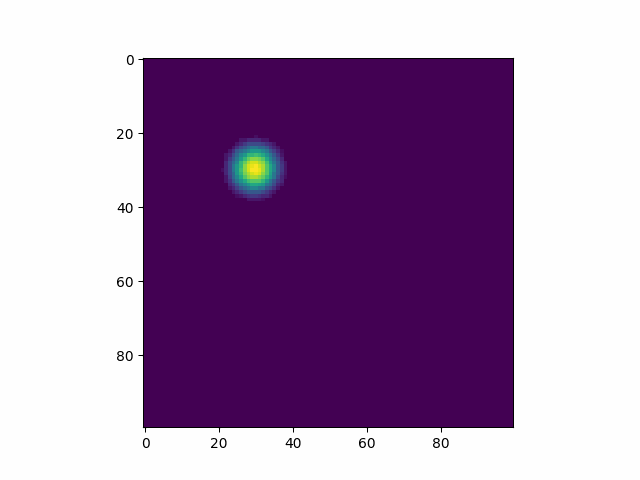

# Coursework 

Sijia Chen

Deadline: 25 February 2022 at 5pm

- Documented source code
  Both simulation and post-processing code
- Animations of the simulation output (Dirichlet and Neumann)
-	Short report on the performance of the code
-	Output log files from HPC runs (*.o* files) in the folder: .o files

### Example plots:
- Dirichlet

- Neumann

